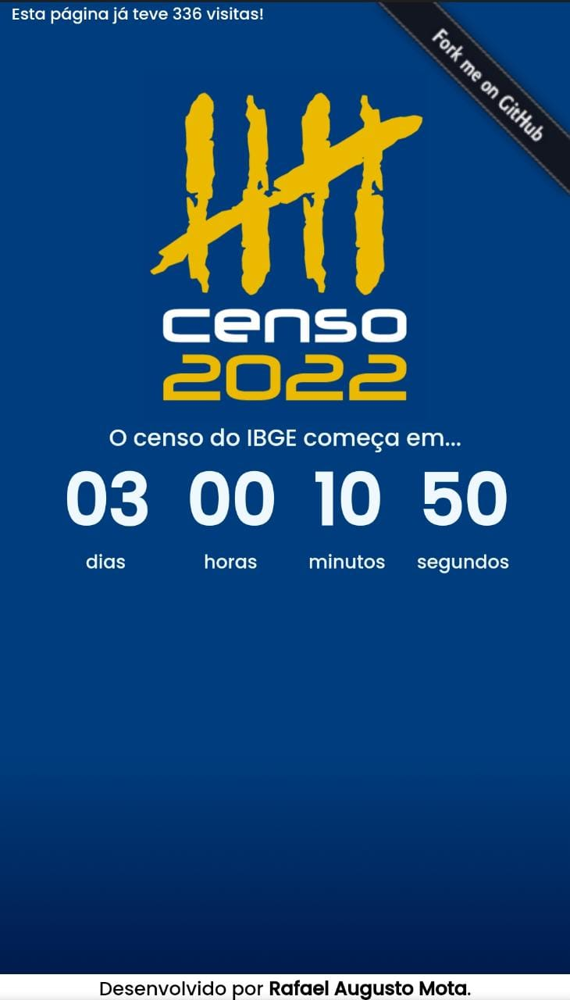

<h1 align="center">Contador Regressivo para o Censo IBGE 2022</h1>

 

  <a href="#dart-sobre">Sobre</a> &#xa0; | &#xa0;
  <a href="#rocket-tecnologias">Tecnologias</a> &#xa0; | &#xa0;
  <a href="#memo-licença">Licença</a> &#xa0; | &#xa0;
  <a href="https://github.com/fael-atom" target="_blank">Autor</a>

 

## :dart: Sobre ##

O Censo Demográfico do Instituto Brasileiro de Geografia e Estatística (IBGE) costuma ocorrer a cada 10 anos e tem um papel fundamental no desenvolvimento de políticas públicas e privadas no Brasil. Com o intuito de divulgar o início do censo de 2022, este projeto traz um contador regressivo exibindo o tempo que falta para a data de 01 de agosto, data de referência para o início do censo.

## :rocket: Tecnologias ##

Neste projeto foram utilizadas as seguintes ferramentas:

- HTML5
- CSS3
- JavaScript
- [CountAPI](https://countapi.xyz/)

## :rocket: Implementação ##

Confira a página do projeto <a href="https://fael-atom.github.io/contador-censo2022/" target="_blank">aqui!</a>

 

## :memo: Licença ##

Este projeto está sob a licença GPL em sua terceira versão. Para mais detalhes, veja o arquivo [LICENSE](LICENSE.md).

## :pray: Agradecimentos

Deixo aqui os meus agradecimentos ao @AVPthegreat do canal [Code to Infinity](https://www.youtube.com/channel/UCc_FxkVCgh3JGBb942ge42g/about) no YouTube pelos ótimos vídeos sobre CountAPI, a API para contagem de visitas na página. Igualmente, meus agradecimentos a @florinpop17 pela excelente API CountAPI. Por fim, minha gratidão ao canal [Danki Code](https://www.youtube.com/c/DankiCode) pelos ótimos vídeos sobre JavaScript.

&#xa0;

<a href="#top">Voltar ao topo</a>
